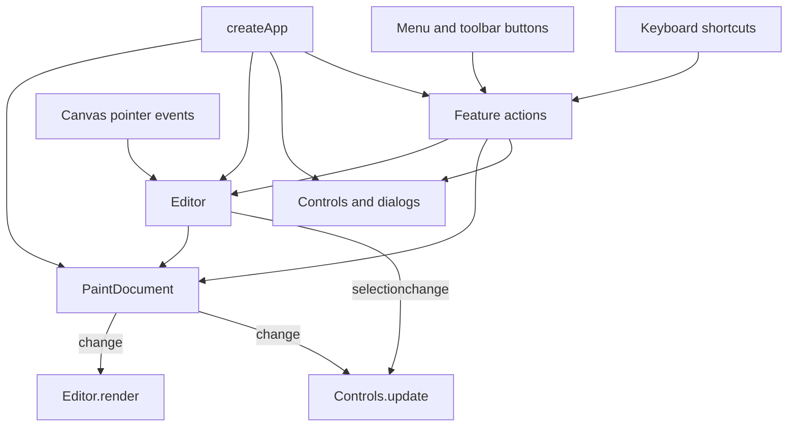

# Paintlet architecture

Paintlet is a single-document raster editor built with JavaScript modules and the
browser's Canvas 2D API. Vite bundles the application into a static site. Drawing,
image decoding, history and PNG encoding happen in the browser; there is no
application server, account system or image upload endpoint.

The central distinction is between the **document bitmap**, which holds the
picture, and the **display canvas**, which shows that picture with temporary
selection overlays. Tools edit pixels, not persistent vector objects. Once text
or a shape is committed, it is part of the bitmap.

## Runtime composition

[`src/main.js`](../src/main.js) loads the stylesheet entry and calls
[`createApp`](../src/app/create-app.js). The application mounts the markup first,
creates one `PaintDocument` and one `Editor`, then connects the controls, dialogs,
feature actions and keyboard bindings. It initializes the color controls and
fits the canvas after the first layout frame.

This diagram shows runtime calls and notifications. The module dependencies are
simpler: `app/` assembles `editor/`, `features/` and `ui/`; the editor modules do
not import features or UI. Dependencies are supplied through factory arguments,
without a global store or service container.

## State and ownership

| Owner | State | Lifetime and meaning |
| --- | --- | --- |
| `PaintDocument` | Bitmap canvas and its 2D context | Current picture, including in-progress stroke or shape pixels |
| `PaintDocument` | `history`, `index`, `saved` | Committed snapshots, current history position and last saved snapshot |
| `Editor` | Tool, colors, size, shape style and zoom | Editing preferences; these are not part of undo history |
| `Editor` | `gesture` and `selection` | Temporary pointer interaction and captured selection pixels |
| `createApp` | `state.filename` | Display and export name; changing the name does not change picture pixels |
| UI factories | Menu visibility, dialog handlers and toast timer | Presentation state held in DOM elements and closures |

The display canvas has the same pixel dimensions as the document. Zoom changes
its CSS size, so it does not resample or resize the picture. Pointer coordinates
are converted from the canvas bounding rectangle into document coordinates.
Selections and their outlines are drawn on the display canvas during rendering;
their outlines never become part of the exported PNG.

## How an edit becomes undoable

For a pencil stroke, `Editor.down()` captures a baseline snapshot and starts a
gesture. Pointer movement writes into the document bitmap and renders the result.
Pointer release calls `PaintDocument.commit()` once, creating one history step
for the whole stroke. Cancellation restores the baseline without adding a step.
Shapes restore that baseline before drawing each preview, avoiding accumulated
preview outlines. Fill commits directly when it changes pixels.

`commit()` discards the redo branch, captures a full `ImageData` snapshot and
emits `change`. Both the editor renderer and UI status controls subscribe to that
event. Undo and redo restore a snapshot, including its dimensions, then emit the
same event. Image actions that write directly to `bitmap.ctx` must commit after
completing the edit to make it undoable and notify the interface.

History is limited to 40 snapshots or a target of 64 MiB of snapshot pixel data,
while always retaining at least two snapshots. This is not a hard application
memory limit: large images can exceed that target with two snapshots alone, and
canvases, gesture baselines and selections consume additional memory.

### Selection movement is deferred

A selection captures a rectangular image and its original position. Dragging it
changes the selection coordinates and marks it as floating; the renderer previews
the old area filled with the captured background color and the image at its new
position. The document bitmap remains unchanged during this move.

`commitSelection()` applies that move to the bitmap and records it in history.
Switching tools and saving both settle a floating selection. Undo first discards
an uncommitted floating move; otherwise it moves back through document history.
Selection changes also emit `selectionchange` on the display canvas so crop,
delete and deselect controls can update without requiring a bitmap edit.

## Commands, dialogs and files

Feature factories return named actions such as `save`, `resize` and `undo`.
`createApp` combines them into one action map. Menu and toolbar buttons dispatch
through `data-action`; shortcuts call the same actions. Tool selection uses
`data-tool` and the catalog definitions instead. Adding an action requires both
an implementation and an entry point; declaring a menu item alone adds no behavior.

The dialog factory returns a promise resolving to `FormData` on confirmation or
`null` on cancellation. Opening a dialog cancels the active gesture and closes
menus. Text placement waits for the selected font to load, draws the text into
the bitmap, and commits it. Ubuntu regular and bold are bundled locally with
their license; the text tool also offers system-font alternatives.

[`features/files.js`](../src/features/files.js) owns opening, dropping, creating
and saving pictures:

- Import accepts PNG, JPEG, WebP, GIF and BMP, up to 32 MiB and 4096 pixels per
  dimension. Decoding uses `createImageBitmap`. An imported image starts a new
  history with a saved baseline; it is drawn onto a white background.
- New and import operations ask before discarding committed unsaved work. A
  floating selection is committed before this decision.
- Save cancels any active gesture, settles the selection and exports the document
  as PNG with `toBlob`. It captures the current history frame before encoding and
  marks that frame as saved afterward, so a later edit remains dirty.
- `dirty` compares the current history frame with `saved`. The unload handler
  also checks for a floating selection. There is no autosave or session recovery;
  downloading a PNG is the persistence mechanism.

## Where changes belong

| Change | Main locations | Boundary to preserve |
| --- | --- | --- |
| Drawing tool or pointer behavior | [`editor/canvas-editor.js`](../src/editor/canvas-editor.js), [`ui/catalog.js`](../src/ui/catalog.js), [`ui/icons.js`](../src/ui/icons.js) | Keep gesture cancellation and one-step undo behavior consistent |
| Pixel storage, fill or history | [`editor/paint-document.js`](../src/editor/paint-document.js) | Notify consumers after committed changes and history navigation |
| Image transformations | [`features/image.js`](../src/features/image.js) | Resolve selection state and commit the completed edit |
| File handling or text placement | [`features/files.js`](../src/features/files.js), [`features/text.js`](../src/features/text.js) | Preserve cancellation, asynchronous completion and saved-frame semantics |
| Selection and undo commands | [`features/selection.js`](../src/features/selection.js) | Distinguish floating selection state from committed history |
| Zoom and color controls | [`features/view.js`](../src/features/view.js), [`ui/controls.js`](../src/ui/controls.js) | Zoom affects presentation, not bitmap dimensions |
| Menus, layout or shortcuts | [`ui/`](../src/ui/), [`app/shortcuts.js`](../src/app/shortcuts.js) | Use the shared action map and keep catalog names in sync |
| Appearance and fonts | [`styles/index.css`](../src/styles/index.css), [`assets/fonts/`](../src/assets/fonts/) | Preserve stylesheet order; responsive overrides load last |

The current UI assumes one editor per page: some selectors and listeners operate
on `document`, and there is no teardown API. Feature modules also use dialogs and
direct canvas access, so they are not a DOM-independent processing library. These
are current boundaries to account for before adding multiple documents, reusable
editor instances, background processing or persistent layers.

## Build and verification

`index.html` is the Vite entry. `npm run build` emits HTML, bundled JavaScript,
CSS and hashed font assets to `dist/`. [`vercel.json`](../vercel.json) configures
`npm ci`, that build command and the static output directory. Deployment needs no
application secret; local environment files and Vercel linkage remain ignored.

Use `npm run dev` for development and `npm run preview` to inspect a production
build. The repository currently has no automated test script. A successful build
checks module and asset resolution, but does not establish drawing correctness.
For changes across these boundaries, browser verification should cover drawing
and undo/redo, bounded fill, selection movement and cancellation, crop/resize/
rotation, text after font loading, PNG import/export, zoom coordinates and mobile
layout. A documentation-only change needs link and source checks, not a rebuild.
